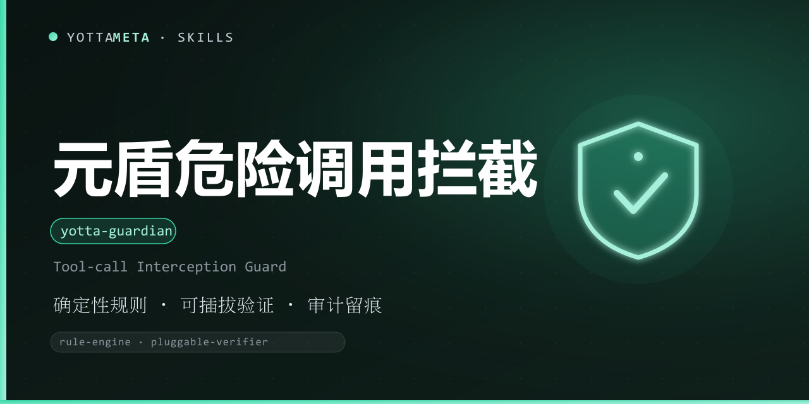

  

<h1 align="center">yotta-guardian · 元盾</h1>

YottaMeta 自有的工具调用拦截护栏：<b>确定性规则引擎 + 可插拔意图验证</b>，对 exec / write / edit / read / run / shell 工具调用做安全评估，输出 allow / deny + 命中规则 + 审计日志。适用于代理要执行高风险命令、写入系统敏感路径、或修改系统配置之前的确定性安全检查。

检测到递归删除、磁盘格式化、提权、防火墙改动、反向 shell、下载即执行、写入系统核心文件等危险操作意图时自动激活——<b>不靠提示词兜底，按规则确定性判定</b>。

纯 Python 3.8+ 标准库实现，零外部依赖；Windows + Linux + macOS 通用；默认只读评估、可配置放行、审计留痕。

  
  
  
  
  
  

## 这是什么

AI 代理在自主执行时，一条递归删除、一次磁盘写入、一段下载即执行，就可能造成不可逆损失。元盾把这些危险动作做成确定性规则引擎：对每一次工具调用（exec / write / edit / read / run / shell）做结构化评估——命令文本、argv 级动词与目标分析、敏感路径、写入内容——给出 allow / deny 判定、命中规则与原因，并支持审计日志留痕。

它不是某个平台的专属功能，而是一份与智能体无关的工具包：装进任何支持 Agent Skills 的智能体即可按需调用。默认只读评估，不自动执行也不放行危险操作；意图验证默认不调用任何模型，可通过协议外接任意验证器（如 LLM 网关）。

## 核心价值

- **确定性规则引擎**：文本模式（下载即执行 / 编码执行 / 反向 shell 等）+ argv 级动词/目标分析（rm / dd / mkfs / chmod / chown / 提权 / 防火墙 / 服务 / 持久化等）+ 敏感路径 + 写入内容，四层规则叠加判定。
- **敏感路径守卫**：/etc/passwd、/etc/sudoers、SSH 授权文件、/boot、/dev 设备、Windows 系统目录与 hosts、注册表启动项等写入即拒。
- **可插拔意图验证（不绑模型）**：默认零依赖；可启用内置本地启发式（--heuristic），也可通过 stdin/stdout JSON 协议外接任意意图验证器（--verifier / 配置文件）。
- **三档策略**：default（拒绝 high+）/ strict（拒绝 medium+）/ loose（仅拒绝 critical），按场景取舍。
- **审计留痕**：JSONL 审计日志 + audit 查询子命令，拒绝/放行全程可追溯。
- **机器可读**：--json 输出纯净 JSON（含逐条判定、规则、退出码），--batch 批量预检，适合智能体在执行前 gate。

## 核心优势

| 优势 | 说明 |
|---|---|
| **零依赖** | Python 3.8+ 标准库，无 daemon / 无数据库 / 无外部扫描器；Windows + Linux + macOS 通用 |
| **确定性** | 规则判定可复现、可解释，不依赖模型概率；意图验证默认关闭，需显式启用 |
| **结构化** | 按工具类型（exec / write / edit / read）分别评估命令、路径与内容，不是简单字符串匹配 |
| **可配置** | --allow / --allow-path / 自定义规则 JSON（policy / deny / allow / verifier） |
| **可追溯** | 每次判定落 JSONL 审计日志，audit 子命令可按拒绝 / 工具 / 时间过滤 |
| **生态分发** | GitHub + npm + ClawHub 三源同步发布；npx / install.sh / 手动复制三种安装方式 |

## 功能体系

| 能力 | 说明 |
|---|---|
| check | 评估一条或一批工具调用（--batch），文本 / JSON / Markdown 报告三种输出 |
| audit | 查询审计日志（--tail / --denied / --since / --tool / --json） |
| rules | 打印内置规则摘要 / 校验自定义规则文件 |
| version | 打印版本 |

## 快速使用

Windows 用 python，Linux/macOS 用 python3。

`_BT_`bash
# 检查一条 exec（0 = 允许）
python3 scripts/yotta_guardian.py check exec --cmd "git status"

# 检查危险命令（默认拒绝，退出码 3）
python3 scripts/yotta_guardian.py check exec --cmd "rm -rf /"

# 检查写操作（写入 /etc/passwd 被拒）
python3 scripts/yotta_guardian.py check write --path /etc/passwd --content "..."

# 批量预检（agent 在执行前把待执行调用列表交给护栏）
python3 scripts/yotta_guardian.py check --batch calls.json --json

# 审计
python3 scripts/yotta_guardian.py check exec --cmd "..." --audit-log .yotta-guardian/audit.jsonl
python3 scripts/yotta_guardian.py audit --file .yotta-guardian/audit.jsonl --tail 20
`_BT_`

退出码语义（与元安 / 元审家族一致）：0 = 允许；1 = 允许但带警告（建议人工复核）；2 = 拒绝（high）；3 = 拒绝（critical）；4 = 用法错误 / 致命异常。

## 安装

三种方式任选其一，技能文件统一从 **npm** 获取（GitHub 无代理时较慢，npm 可配国内镜像加速）。

### 方式一：npm（推荐，一行安装）
`_BT_`bash
# 国内加速（可选）：npm config set registry https://registry.npmmirror.com
npx -y @yottameta/yotta-guardian -g
npx -y @yottameta/yotta-guardian --dir <你的技能目录>   # 任意智能体：指定目录安装
`_BT_`
> 智能体不在预置列表里？用 --dir 指定它的 skills 目录，或手动复制（方式三）。--list 可查看各智能体对应的默认目录。想手动拿文件也可 npm pack @yottameta/yotta-guardian 解包后按方式二/三安装。

### 方式二：install.sh 一键安装
获取技能文件夹后（npm pack 解包或 git clone），进入技能文件夹：
`_BT_`bash
bash install.sh -g    # 用户级；bash install.sh --list 查看全部目录
bash install.sh --agent codex   # 指定智能体（--list 可查看可用项）
bash install.sh       # 项目级：自动检测已存在的 .claude/.cursor/.codex 等 skills 目录
bash install.sh --dir /path/to/skills
`_BT_`
> 覆盖 17 类智能体，含国内 Trae / Qwen / Comate / CodeBuddy / Kimi。Windows 用户：装有 Git Bash 即可用；否则用方式三手动复制。

### 方式三：手动复制
把整个 yotta-guardian 文件夹复制到目标智能体的 skills 目录。常见位置（用户级；Windows 用 %USERPROFILE%，Linux/macOS 用 ~）：

| 智能体 | 用户级目录 | 项目级目录 |
|---|---|---|
| Codex | %USERPROFILE%\.codex\skills\yotta-guardian\ | .codex\skills\ |
| Claude Code | %USERPROFILE%\.claude\skills\yotta-guardian\ | .claude\skills\ |
| Cursor | %USERPROFILE%\.cursor\skills\yotta-guardian\ | .cursor\skills\ |
| Windsurf | %USERPROFILE%\.codeium\windsurf\skills\yotta-guardian\ | .windsurf\skills\ |
| opencode | %USERPROFILE%\.config\opencode\skills\yotta-guardian\ | .opencode\skills\ |
| Gemini | %USERPROFILE%\.gemini\skills\yotta-guardian\ | .gemini\skills\ |
| Goose | %USERPROFILE%\.config\goose\skills\yotta-guardian\ | .goose\skills\ |
| Amp | %USERPROFILE%\.config\agents\skills\yotta-guardian\ | .agents\skills\ |
| Kiro | %USERPROFILE%\.kiro\skills\yotta-guardian\ | .kiro\skills\ |
| WorkBuddy | %USERPROFILE%\.workbuddy\skills\yotta-guardian\ | .workbuddy\skills\ |
| Trae Code CLI | %USERPROFILE%\.traecli\skills\yotta-guardian\ | .traecli\skills\ |
| Trae IDE（国内） | %USERPROFILE%\.trae-cn\skills\yotta-guardian\ | .trae\skills\ |
| Qwen Code | %USERPROFILE%\.qwen\skills\yotta-guardian\ | .qwen\skills\ |
| Comate | %USERPROFILE%\.comate\skills\yotta-guardian\ | .comate\skills\ |
| CodeBuddy | %USERPROFILE%\.codebuddy\skills\yotta-guardian\ | .codebuddy\skills\ |
| Kimi | %USERPROFILE%\.kimi\skills\yotta-guardian\ | .kimi\skills\ |
| 通用 AGENTS.md | %USERPROFILE%\.agents\skills\yotta-guardian\ | .agents\skills\ |

> Codex 默认目录若设置了环境变量 CODEX_HOME，以该变量为准；opencode 若设置 XDG_CONFIG_HOME 同理。.agents\skills 并非通用目录，仅 OpenCode / Cursor / Cline / Amp / Kimi / Gemini CLI / GitHub Copilot 等会读取，Claude Code 与 Codex 默认不读。不确定时用 --dir 指定，或让该智能体自行安装。

## 使用示例（AI 智能体）

1. 将本仓库的 SKILL.md 接入任意 AI 智能体的技能/规则系统（见上方安装）。
2. 在执行任何高风险工具调用前，先跑一次 check：
   `_BT_`bash
   python3 scripts/yotta_guardian.py check exec --cmd "<待执行命令>" --json
   `_BT_`
   退出码 2 / 3 时不要执行，向用户说明命中规则；确有授权再用 --allow / --allow-path / 自定义规则放行。
3. 一次要执行多条时，用 --batch 批量预检：
   `_BT_`bash
   python3 scripts/yotta_guardian.py check --batch calls.json --json
   `_BT_`
4. 写敏感路径 / 修改系统配置前，用 write / edit 检查目标路径与内容。
5. 高风险操作落审计日志，事后用 audit 查询。

## 开发与校验

- 测试：python scripts/test_yotta_guardian.py（60 项）
- 基础校验：python tools/validate-skill.py yotta-guardian（在仓库根目录运行）
- 规则说明：references/rules.md；策略与退出码：references/policies.md；意图验证器协议：references/intent-verifier.md

## 许可证

MIT © YottaMeta —— 详见 [LICENSE](./LICENSE)。

## 致谢

护栏/拦截方向参考开源社区 safe-guardian 类技能思路，实现为 YottaMeta 全新自有代码（详见 [NOTICE](./NOTICE)）。
